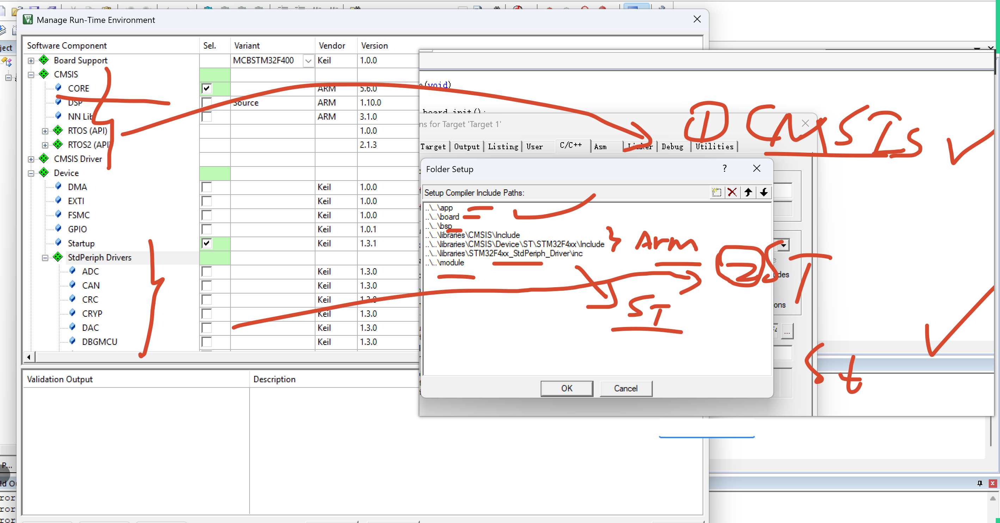
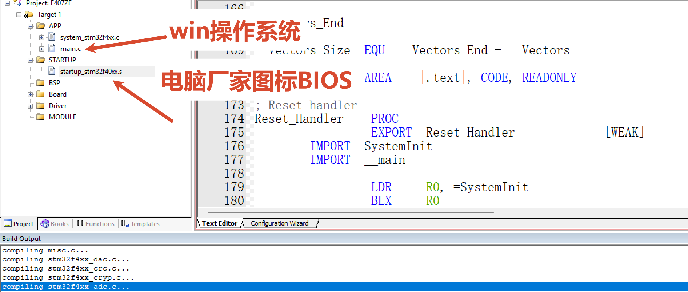
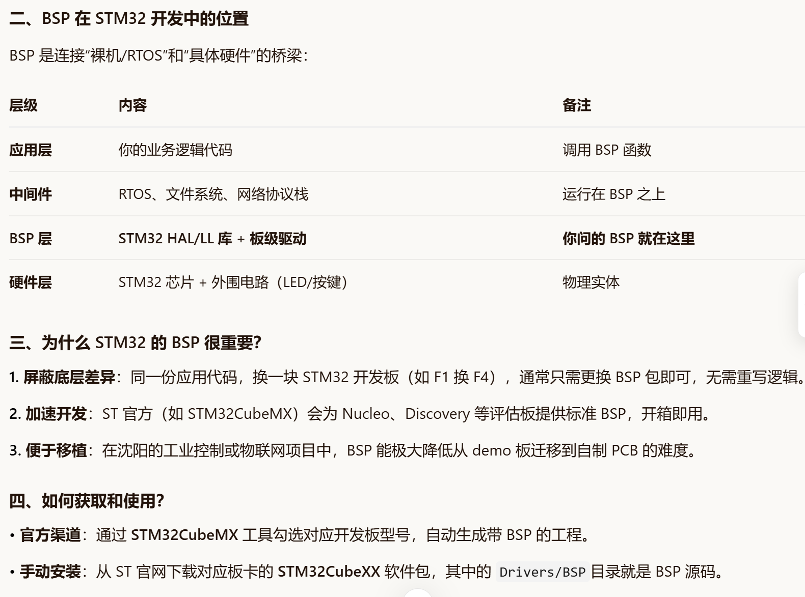

# 1 - 环境搭建与代码移植

> **课程定位：** 5天IoT实训 · 第一天  
> **主题：** 重新上手 STM32F407 · 工程模板 · 寄存器/库函数点灯 · SysTick 延时  
> **目标硬件：** STM32F407ZET6 开发板（LED1 → PG14，LED2 → PG13，LED3 → PG6）

---

## 一、开发环境安装

### 1.1 安装 Keil5 MDK


**安装步骤：**

1. 下载 MDK-ARM v5.x 安装包（官网或课程资料包）
2. 以**管理员身份**运行安装程序，路径不要有中文或空格
3. 安装完成后打开 Keil，菜单 `File → License Management` 激活

:::tip 版本说明
本课程统一使用 **Keil MDK v5.36+**，编译器选 **ARM Compiler 5（AC5）**。
:::

---

### 1.2 安装 STM32F4 芯片支持包



**方法一：在线安装（需要网络）**

1. 打开 Keil → `Pack Installer`
2. 在 Device 栏搜索 `STM32F407`
3. 找到 `Keil::STM32F4xx_DFP`，点击 **Install**

**方法二：离线安装（推荐，速度快）**

```bash
# 双击 .pack 文件直接安装，或从命令行：
# 将 .pack 文件放到 Keil 安装目录的 Packs 文件夹后重启即可
```

---

### 1.3 认识 .s 启动文件



STM32 上电后第一个执行的不是 `main()`，而是汇编启动文件 `startup_stm32f40_41xxx.s`：

| 启动文件完成的工作 | 说明 |
|---|---|
| 初始化堆栈指针 SP | 指向 RAM 末尾 |
| 复制 .data 段到 RAM | 初始化全局变量 |
| 清零 .bss 段 | 未初始化全局变量赋 0 |
| 调用 `SystemInit()` | 配置系统时钟 |
| 跳转到 `main()` | 开始执行用户代码 |

---

## 二、工程模板结构

本课程统一使用三层分层架构：

```
STM32F407_ProjectTemplate/
├── app/
│   └── main.c              ← 应用层：业务逻辑
├── board/
│   └── board.c             ← 板级初始化：SysTick 延时
├── bsp/
│   └── uart/
│       ├── bsp_uart.c      ← 串口驱动（UART1）
│       └── bsp_uart.h
├── module/
│   └── stm32f4xx_it.c      ← 中断服务函数
├── libraries/
│   ├── CMSIS/              ← ARM 内核头文件
│   └── STM32F4xx_StdPeriph_Driver/  ← ST 标准外设库
└── project/MDK(V5)/        ← Keil 工程文件 (.uvprojx)
```

:::note 分层设计原则
- **app层** 只调用 BSP 接口，不直接操作寄存器
- **bsp层** 封装具体硬件，换板子只改这里
- **libraries层** 不修改，保持原厂代码
:::



---

## 三、GPIO 点灯

### 3.1 方式1：寄存器直接操作

**目标：** 点亮 LED1（PG14，低电平亮）

#### 步骤拆解

```c
/* 1. 开启 GPIOG 时钟 —— AHB1ENR 第 6 位置 1 */
RCC->AHB1ENR |= (0x01 << 6);

/* 2. 配置 PG14 为输出模式 —— MODER[29:28] = 01 */
GPIOG->MODER &= ~(0x03 << (14 * 2));   // 先清零（防脏数据）
GPIOG->MODER |=  (0x01 << (14 * 2));   // 写入输出模式

/* 3. 配置输出速度为最高速 —— OSPEEDR[29:28] = 11 */
GPIOG->OSPEEDR |= (0x03 << (14 * 2));

/* 4. 无上下拉 —— PUPDR[29:28] = 00 */
GPIOG->PUPDR &= ~(0x03 << (14 * 2));

/* 5. ODR 输出低电平 → LED 亮 */
GPIOG->ODR &= ~(0x01 << 14);
```

#### 寄存器速查

| 寄存器 | 作用 | 地址偏移 |
|---|---|---|
| `AHB1ENR` | 外设时钟使能 | `0x30` |
| `MODER` | 引脚模式（输入/输出/AF/模拟） | `0x00` |
| `OSPEEDR` | 输出速度 | `0x08` |
| `PUPDR` | 上下拉 | `0x0C` |
| `ODR` | 输出数据（直接写） | `0x14` |
| `BSRR` | 置位/复位（原子操作） | `0x18` |

:::tip 为什么先 `&= ~` 再 `|=`？
每个引脚占 MODER 中 **2 位**。直接 `|=` 会把原有的位叠加进去（例如本来是 `10` 模拟模式，你只想设 `01` 输出，直接 `|=` 变成 `11`，实际是 AF 模式）。必须先清零对应位，再写入目标值。
:::

---

### 3.2 方式2：标准外设库函数

**目标：** 点亮 LED2（PG13）

```c
#include "board.h"

int main(void)
{
    board_init();  // 初始化系统（SysTick 等）

    GPIO_InitTypeDef GPIO_InitStructure;

    /* 1. 使能 GPIOG 时钟 */
    RCC_AHB1PeriphClockCmd(RCC_AHB1Periph_GPIOG, ENABLE);

    /* 2. 配置引脚参数 */
    GPIO_InitStructure.GPIO_Pin   = GPIO_Pin_13;
    GPIO_InitStructure.GPIO_Mode  = GPIO_Mode_OUT;   // 输出
    GPIO_InitStructure.GPIO_OType = GPIO_OType_PP;   // 推挽
    GPIO_InitStructure.GPIO_Speed = GPIO_Speed_100MHz;
    GPIO_InitStructure.GPIO_PuPd  = GPIO_PuPd_NOPULL;

    /* 3. 初始化 */
    GPIO_Init(GPIOG, &GPIO_InitStructure);

    /* 4. 输出低电平 → LED 亮 */
    GPIO_ResetBits(GPIOG, GPIO_Pin_13);

    while (1) {}
}
```

#### 库函数对比寄存器操作

| 操作 | 寄存器写法 | 库函数写法 |
|---|---|---|
| 开时钟 | `RCC->AHB1ENR \|= (1<<6)` | `RCC_AHB1PeriphClockCmd(GPIOG, ENABLE)` |
| 输出低 | `GPIOG->ODR &= ~(1<<13)` | `GPIO_ResetBits(GPIOG, GPIO_Pin_13)` |
| 输出高 | `GPIOG->ODR \|= (1<<13)` | `GPIO_SetBits(GPIOG, GPIO_Pin_13)` |
| 翻转 | `GPIOG->ODR ^= (1<<13)` | `GPIO_ToggleBits(GPIOG, GPIO_Pin_13)` |

:::note 库函数优缺点
**优点：** 可读性好，移植方便，不容易出错  
**缺点：** 代码体积稍大，执行效率略低  
**本课程选择：** 驱动层使用库函数，追求极致性能的场合再看寄存器
:::

---

## 四、SysTick 延时函数

### 4.1 SysTick 是什么

SysTick 是 Cortex-M4 内核自带的 **24 位递减计数器**，每个系统时钟周期减 1，减到 0 时产生中断（或轮询检测）。STM32F407 默认主频 **168 MHz**，1 个时钟周期 = 约 5.95 ns。

### 4.2 初始化（board_init）

```c
void board_init(void)
{
    // 中断向量表定位到 Flash 起始
    SCB->VTOR = (0x08000000 & 0x3FFFFF80);

    // SysTick 时钟源选系统时钟（168 MHz）
    SysTick_CLKSourceConfig(SysTick_CLKSource_HCLK);

    // 重装值设为最大（0xFFFF），先让它跑起来
    SysTick->LOAD = 0xFFFF;

    // 使能 SysTick，开始计数
    SysTick->CTRL |= SysTick_CTRL_ENABLE_Msk;
}
```

### 4.3 微秒延时实现

```c
void delay_us(uint32_t _us)
{
    uint32_t ticks = _us * (SystemCoreClock / 1000000); // 需要等待的节拍数
    uint32_t told  = SysTick->VAL;  // 记录起始计数值
    uint32_t tcnt  = 0;

    while (1)
    {
        uint32_t tnow = SysTick->VAL;
        if (tnow != told)
        {
            // 计数器递减，tnow < told 是正常情况
            // tnow > told 说明发生了一次溢出回绕
            tcnt += (tnow < told) ? (told - tnow)
                                  : (SysTick->LOAD - tnow + told);
            told = tnow;
            if (tcnt >= ticks) break;
        }
    }
}

void delay_ms(uint32_t _ms) { delay_us(_ms * 1000); }
```

**要点：** 使用"差值累加"而不是"固定计时"，正确处理了计数器**溢出回绕**的情况。

### 4.4 LED 闪烁实验

**目标：** LED3（PG6）每隔 1 秒翻转一次

```c
int main(void)
{
    board_init();

    GPIO_InitTypeDef GPIO_InitStructure;
    RCC_AHB1PeriphClockCmd(RCC_AHB1Periph_GPIOG, ENABLE);

    GPIO_InitStructure.GPIO_Pin   = GPIO_Pin_6;
    GPIO_InitStructure.GPIO_Mode  = GPIO_Mode_OUT;
    GPIO_InitStructure.GPIO_OType = GPIO_OType_PP;
    GPIO_InitStructure.GPIO_Speed = GPIO_Speed_100MHz;
    GPIO_InitStructure.GPIO_PuPd  = GPIO_PuPd_NOPULL;
    GPIO_Init(GPIOG, &GPIO_InitStructure);

    while (1)
    {
        GPIO_SetBits(GPIOG, GPIO_Pin_6);   // 灭
        delay_ms(1000);
        GPIO_ResetBits(GPIOG, GPIO_Pin_6); // 亮
        delay_ms(1000);
    }
}
```

---

## 五、UART1和printf重定向

### 5.1 UART1 引脚

| 信号 | 引脚 | 说明 |
|---|---|---|
| TX | PA9 | 发送，需配置为复用推挽（AF7） |
| RX | PA10 | 接收，配置为复用模式 |

### 5.2 初始化代码

```c
void uart1_init(uint32_t baud)
{
    GPIO_InitTypeDef  GPIO_InitStructure;
    USART_InitTypeDef USART_InitStructure;
    NVIC_InitTypeDef  NVIC_InitStructure;

    /* 1. 开启时钟 */
    RCC_AHB1PeriphClockCmd(RCC_AHB1Periph_GPIOA, ENABLE);
    RCC_APB2PeriphClockCmd(RCC_APB2Periph_USART1, ENABLE);

    /* 2. IO 复用为 USART1（AF7） */
    GPIO_PinAFConfig(GPIOA, GPIO_PinSource9,  GPIO_AF_USART1);
    GPIO_PinAFConfig(GPIOA, GPIO_PinSource10, GPIO_AF_USART1);

    /* 3. 配置 PA9 TX */
    GPIO_InitStructure.GPIO_Pin   = GPIO_Pin_9;
    GPIO_InitStructure.GPIO_Mode  = GPIO_Mode_AF;
    GPIO_InitStructure.GPIO_Speed = GPIO_Speed_100MHz;
    GPIO_InitStructure.GPIO_OType = GPIO_OType_PP;
    GPIO_InitStructure.GPIO_PuPd  = GPIO_PuPd_UP;
    GPIO_Init(GPIOA, &GPIO_InitStructure);

    /* 4. 配置 PA10 RX（同上） */
    GPIO_InitStructure.GPIO_Pin = GPIO_Pin_10;
    GPIO_Init(GPIOA, &GPIO_InitStructure);

    /* 5. USART1 参数 */
    USART_InitStructure.USART_BaudRate            = baud;
    USART_InitStructure.USART_WordLength          = USART_WordLength_8b;
    USART_InitStructure.USART_StopBits            = USART_StopBits_1;
    USART_InitStructure.USART_Parity              = USART_Parity_No;
    USART_InitStructure.USART_Mode                = USART_Mode_Rx | USART_Mode_Tx;
    USART_InitStructure.USART_HardwareFlowControl = USART_HardwareFlowControl_None;
    USART_Init(USART1, &USART_InitStructure);

    /* 6. 使能接收中断 */
    USART_ITConfig(USART1, USART_IT_RXNE, ENABLE);
    USART_Cmd(USART1, ENABLE);

    /* 7. NVIC：中断优先级 */
    NVIC_InitStructure.NVIC_IRQChannel                   = USART1_IRQn;
    NVIC_InitStructure.NVIC_IRQChannelPreemptionPriority = 0;
    NVIC_InitStructure.NVIC_IRQChannelSubPriority        = 1;
    NVIC_InitStructure.NVIC_IRQChannelCmd                = ENABLE;
    NVIC_Init(&NVIC_InitStructure);
}
```

### 5.3 printf 重定向

通过重写 `fputc` 函数，将 `printf` 的输出绑定到 USART1：

```c
int fputc(int ch, FILE *f)
{
    USART_SendData(USART1, (uint8_t)ch);
    // 等待发送完成
    while (RESET == USART_GetFlagStatus(USART1, USART_FLAG_TXE)) {}
    return ch;
}
```

> **使用前提：** Keil 工程 Options → Target → 勾选 **Use MicroLIB**（否则需要额外配置 `__FILE` 结构体）

---

## 六、课后验收标准

| 验收项 | 判断方式 | 目标 |
|---|---|---|
| 编译下载 | Keil 0 错误 0 警告 | ✅ |
| 寄存器点灯 | LED1（PG14）常亮 | ✅ |
| 库函数点灯 | LED2（PG13）常亮 | ✅ |
| SysTick 闪烁 | LED3（PG6）每秒闪一次 | ✅ |
| printf 输出 | 串口助手（115200）收到开机打印 | ✅ |

---

## 七、常见问题

**Q: 编译提示 `cannot open source file "stm32f4xx.h"`？**  
A: 芯片支持包未安装，或 Keil 工程 `Include Path` 未包含 `libraries/CMSIS/Include` 和标准库头文件路径。

**Q: 下载后 LED 不亮，但编译没报错？**  
A: 检查以下几点：① J-Link/ST-Link 驱动是否安装；② Keil Flash Download 选项是否选对芯片；③ LED 正负极方向（本板低电平亮）；④ 是否忘记调用 `board_init()`。

**Q: `delay_ms(1000)` 实际只延时了几毫秒？**  
A: `SystemCoreClock` 获取的频率不对，检查 `system_stm32f4xx.c` 中的 `PLL` 配置是否与实际晶振匹配（外部晶振通常 8 MHz 或 25 MHz）。

**Q: printf 没有输出？**  
A: ① 检查是否勾选了 MicroLIB；② 串口助手波特率是否为 115200；③ USB-TTL 线 TX/RX 是否交叉连接（板 TX → 模块 RX）。

---

## 八、课程代码索引

本课程配套代码位于 `STM32F407ZE代码/` 目录，共 **15 个递进式实验工程** + 预编译烧录文件，按难度顺序排列。

### 8.1 工程总览

| 编号 | 工程名称 | 核心知识点 | 关键源文件 |
|---|---|---|---|
| 001 | 寄存器点灯 | 直接操作 RCC/GPIO 寄存器，位操作置位/清位 | `app/main.c` |
| 002 | 库函数点灯 | 标准外设库 `GPIO_Init` + `GPIO_SetBits` | `app/main.c` |
| 003 | 滴答定时器灯闪烁 | SysTick 差值累加延时，溢出回绕处理 | `board/board.c` |
| 004 | 位带操作 | Cortex-M4 位带别名区，单比特原子读写 | `app/main.c` |
| 005 | 串口打印信息 | UART1 初始化 + `fputc` printf 重定向 | `bsp/uart/bsp_uart.c` |
| 006 | 按键点灯 | GPIO 输入轮询 + 软件消抖 | `app/main.c` |
| 007 | 外部中断按键点灯 | EXTI 外部中断配置，NVIC 优先级分组 | `app/main.c` |
| 008 | 定时器灯闪烁 | TIM 基本定时器中断，ARR/PSC 计算 | `app/main.c` |
| 009 | PWM 呼吸灯 | TIM 输出比较 PWM 模式，占空比渐变 | `app/main.c` |
| 010 | 串口中断DMA接收二合一 | UART 中断 + DMA 接收不定长数据帧 | `bsp/uart/bsp_uart.c` |
| 011 | ADC 采集 | ADC1 规则通道单次转换，DMA 搬运结果 | `app/main.c` |
| 012 | 软件I2C (SHT20) | GPIO 模拟 I2C 时序，读取温湿度传感器 | `bsp/bsp_sht20.c` |
| 013 | 软件SPI (Flash) | GPIO 模拟 SPI 四线时序，W25Q128 读写 | `bsp/flash/spi_flash.c` |
| 014 | 硬件SPI (Flash) | SPI 外设硬件加速，DMA 提升吞吐 | `bsp/flash/spi_flash.c` |
| 015 | RTC 时钟实验 | RTC 掉电保持（VBAT），日期时间读写 | `bsp/rtc/rtc.c` |

### 8.2 工程结构（统一模板）

所有工程均采用相同的三层分层架构：

```
STM32F407ZE代码/
├── 001寄存器点灯/
│   └── STM32F407_ProjectTemplate/
│       ├── app/
│       │   └── main.c              ← 应用层业务逻辑
│       ├── board/
│       │   ├── board.c             ← SysTick 延时、系统初始化
│       │   └── board.h
│       ├── bsp/
│       │   └── uart/
│       │       ├── bsp_uart.c      ← 串口驱动（printf 重定向）
│       │       └── bsp_uart.h
│       ├── module/
│       │   ├── stm32f4xx_conf.h    ← 外设库使能配置
│       │   └── stm32f4xx_it.c      ← 中断服务函数
│       └── libraries/              ← ST 标准外设库（不修改）
│
├── 012软件I2C(SHT20)/              ← 新增 bsp_sht20.c/h
├── 013软件SPI(flash)/              ← 新增 bsp/flash/spi_flash.c/h
├── 014硬件SPI(flash)/              ← 新增 bsp/flash/spi_flash.c/h
├── 015RTC时钟实验(可做掉电实验)/   ← 新增 bsp/rtc/rtc.c/h
│
└── 测试/                           ← 预编译 .hex，可直接烧录验证
    ├── 001寄存器点灯.hex
    ├── 002库函数点灯.hex
    ├── 003滴答定时器灯闪烁.hex
    ├── 004位带操作.hex
    ├── 005串口打印信息.hex
    ├── 006按键点灯.hex
    ├── 007外部中断按键点灯.hex
    ├── 008定时器灯闪烁.hex
    ├── 010串口中断DMA接收二合一.hex
    ├── 011ADC采集.hex
    ├── 012软件I2C(SHT20).hex
    ├── 013软件SPI(flash).hex
    ├── 014硬件SPI(flash).hex
    └── 015RTC时钟实验(可做掉电实验).hex
```

### 8.3 Day 1 重点工程

与本天内容直接相关的工程：

| 工程 | 与 Day 1 的关联 |
|---|---|
| **001 寄存器点灯** | 对应第三章：直接操作 RCC/GPIO 寄存器控制 LED1（PG14） |
| **002 库函数点灯** | 对应第三章：使用标准外设库控制 LED2（PG13） |
| **003 滴答定时器灯闪烁** | 对应第四章：SysTick 延时 + LED3（PG6）每秒闪烁 |
| **005 串口打印信息** | 对应第五章：UART1 初始化 + printf 重定向 |

:::tip 快速验证
不想重新编译？直接用 **`测试/` 目录下的 .hex 文件**通过 Keil Flash 或 ST-Link Utility 烧录即可，每个实验约 30 秒完成验证。
:::
