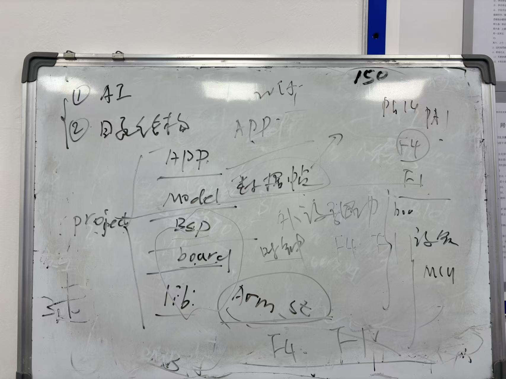
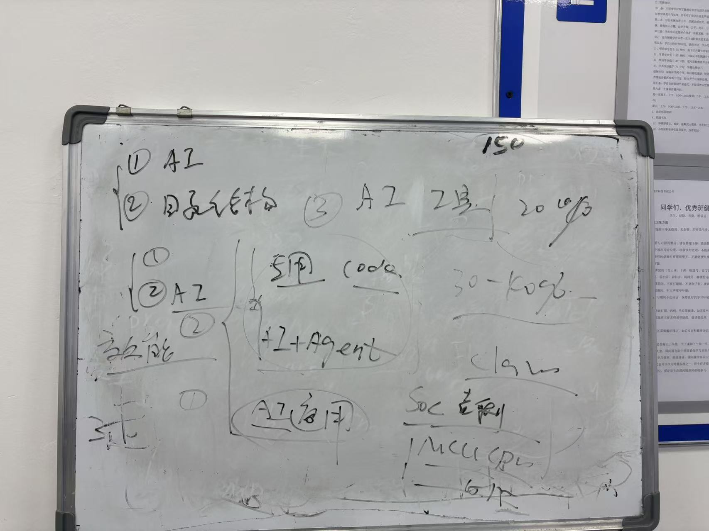
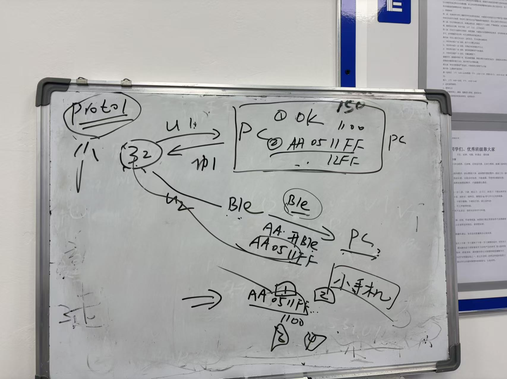
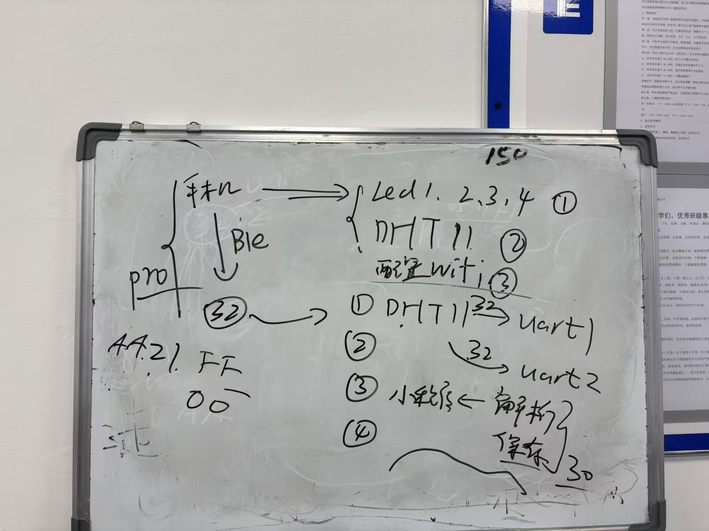
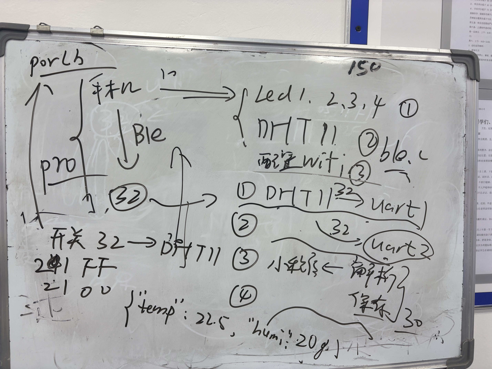
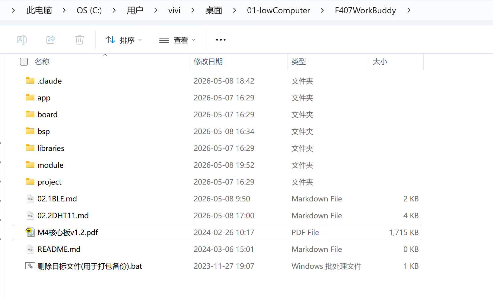

---
sidebar_position: 3
title: 3-蓝牙与温湿度
---

# Day 3 — 蓝牙通信与温湿度采集

> **课程定位：** 5天IoT实训 · 第三天
> **主题：** DX-BT24 蓝牙模块驱动 · DHT11 温湿度采集 · 数据帧协议扩展 · 小程序联调
> **目标硬件：** STM32F407ZET6 + DX-BT24 + DHT11

---

## 一、课程回顾与架构升级





Day 2 完成了小程序通过 BLE 控制 LED 的基础链路。Day 3 在此基础上：
- 接入 **DHT11 温湿度传感器**，扩展数据帧协议
- 实现小程序实时显示温湿度折线图
- 梳理**嵌入式软件开发流程与文档体系**

参考文档：[嵌入式软件开发流程 & 文档体系](https://viviwong.github.io/web/04-Embedded-Development-Workflow-and-Documentation-System.html)

---

## 二、DX-BT24 蓝牙模块

### 2.1 模块特性

DX-BT24 是**透传型 BLE 模块**，默认上电即广播，无需 AT 指令初始化。

| 特性 | 说明 |
| :--- | :--- |
| 工作模式 | 透传模式（默认），上电即广播 |
| 默认波特率 | 9600 bps |
| 接口 | UART（9600, 8N1） |
| 透传原理 | 小程序 BLE 发送 → 模块串口转发给 STM32 → STM32 串口回复 → 模块发给小程序，完全透明 |

### 2.2 硬件引脚连接

| STM32 引脚 | 功能 | 连接 | 备注 |
| :--- | :--- | :--- | :--- |
| PA2 (UART2 TX) | 发送 | → BLE 模块 RX | 9600, 8N1 |
| PA3 (UART2 RX) | 接收 | ← BLE 模块 TX | 中断 + 环形缓冲 |

### 2.3 UART 接口分配

| UART | 波特率 | 用途 | 数据格式 |
| :--- | :--- | :--- | :--- |
| UART1 | 115200 | PC 调试 / 透传 | 原始帧数据 |
| UART2 | 9600 | BLE DX-BT24 通信 | 原始帧数据 / JSON |
| UART3 | 115200 | ESP8266 Wi-Fi 模块 | 原始帧数据 / JSON |

### 2.4 BLE 控制数据帧（DevID 0x31）

控制蓝牙模块开播/关播：

**帧格式：** `AA 05 31 [操作] [SUM]`

| 操作 | 含义 | 完整帧 | SUM 计算 |
| :--- | :--- | :--- | :--- |
| `0x01` | 蓝牙开播（广播） | `AA 05 31 01 E1` | AA+05+31+01=0xE1 |
| `0x00` | 蓝牙关播 | `AA 05 31 00 E0` | AA+05+31+00=0xE0 |

### 2.5 测试工具

调试 BLE 模块可使用大夏龙雀官方测试 APP，也可以用自己写小程序验证串口透传。


**微信测试小程序**


- 官网资料：[szdx-smart.com](http://www.szdx-smart.com/zlxz/kfgj.html)
- 单片机例程网盘：[百度网盘](https://pan.baidu.com/s/1TM_bhhZxs1XYpwCInLnWmQ?pwd=DXLQ)

### 2.6 连接蓝牙后调试结构图



---

## 三、DHT11 温湿度模块

### 3.1 硬件引脚

| STM32 引脚 | 功能 | 备注 |
| :--- | :--- | :--- |
| PG9 | DHT11 DQ 单总线数据 | 需 4.7kΩ 上拉，输入/输出模式动态切换 |

### 3.2 通讯协议（DevID 0x21）

#### 下行控制帧（上位机 → MCU）

控制 MCU 开启或关闭温湿度定时发送功能。

**帧格式：** `AA [LEN] 21 [CMD] [SUM]`

| 字节索引 | 定义 | 长度 | 说明 |
| :--- | :--- | :--- | :--- |
| 0 | 帧头 | 1 B | 固定 `0xAA` |
| 1 | 数据总长度 LEN | 1 B | 固定 `0x05` |
| 2 | DevID | 1 B | 固定 `0x21` |
| 3 | 控制命令 CMD | 1 B | `0xFF` 开启 / `0x00` 关闭 |
| 4 | SUM 校验 | 1 B | `(AA + LEN + DevID + CMD) & 0xFF` |

**示例：**

| 操作 | 帧 | SUM 计算 |
| :--- | :--- | :--- |
| 开启发送 | `AA 05 21 FF CF` | AA+05+21+FF=0x1CF → 0xCF |
| 关闭发送 | `AA 05 21 00 D0` | AA+05+21+00=0xD0 |

#### 上行上报帧（MCU → 上位机）

MCU 定时上报或响应 PING，JSON 格式负载：

**帧格式：** `AA [LEN] 21 [JSON_DATA] [SUM]`

| 字段 | 说明 |
| :--- | :--- |
| `temp` | 温度，float，单位 ℃，保留两位小数，如 `25.00` |
| `humi` | 湿度，float，单位 %，保留两位小数，如 `60.00` |

**完整示例**（温度 25℃，湿度 60%）：

```
JSON 内容：{"temp":25.00,"humi":60.00}  (27 字节)
LEN = 1(LEN) + 1(DevID) + 27(JSON) + 1(SUM) = 30 = 0x1E
完整帧：AA 1E 21 7B 22 74 65 6D 70 22 3A 32 35 2E 30 30 2C 22 68 75 6D 69 22 3A 36 30 2E 30 30 7D [SUM]
SUM = (AA + 1E + 21 + JSON所有字节之和) & 0xFF
```

### 3.3 调试流程





**MCU 固件逻辑（C 语言）：**

> 解析串口数据：收到 `AA 05 21 FF CF` 则开启定时上报（10秒/次）。上报时读取 DHT11 整数值，格式化为 `{"temp":XX.00,"humi":YY.00}`。封装帧：帧头 `AA`，总长度，DevID `0x21`，JSON 内容，最后计算全字节 SUM 校验。

**上位机解析逻辑（Python）：**

> 监听串口，查找 `0xAA` 帧头。根据第 2 字节（LEN）确定包长度。验证 SUM：前 `LEN+1` 字节之和的低 8 位等于最后字节。校验通过且 DevID 为 `0x21` 时，解析 JSON 获取温湿度并展示。

---

## 四、小程序联调效果


---

## 五、开发文档体系



嵌入式项目开发的完整文档链路：

| 文档类型 | 内容 | 时机 |
| :--- | :--- | :--- |
| 发送给AI的文档 | 硬件引脚、协议帧格式、代码约束 | 开发前给 AI 提供上下文 |
| Bug 记录与修复 | 现象 + 根因 + 修复方案 | 调试过程中实时记录 |
| 通讯协议手册 | 所有 DevID、帧格式、SUM 计算 | 联调前与小程序端对齐 |

---

## 六、Bug 记录与修复

### Bug 1：温湿度串口无法显示

**现象：** 发送 `AA 05 21 FF CF` 后，UART1 无 JSON 输出，BLE 也收不到数据。

**根因：** `protocol.c` 中 `json_buf[24]` 缓冲区太小。

```
JSON {"temp":25.00,"humi":60.00} 实际 27 字节
json_buf 只有 24 字节
snprintf 返回 27，触发 json_len >= sizeof(json_buf) → 提前 return
```

**修复：**

| 问题 | 错误值 | 修复值 |
| :--- | :--- | :--- |
| `json_buf` 大小 | `[24]` | `[32]`（预留余量） |
| `LEN` 字段计算 | `json_len + 3` | `json_len + 4`（AA + LEN + DevID + JSON + SUM） |

**验证：** 重新编译烧录后，发送 `AA 05 21 FF CF`，等待 10 秒，UART1 出现 JSON 帧和调试打印，BLE 同步收到数据。

### Bug 2：小程序温湿度数据格式不匹配

**现象：** 小程序无法解析温湿度数据。

**原因：** 小程序端期望的是**控制指令 + JSON 数据包**格式，而固件发送的格式与协议文档不一致。

**修复：** 统一按协议手册（DevID `0x21`，JSON 负载）对齐固件与小程序端解析逻辑。