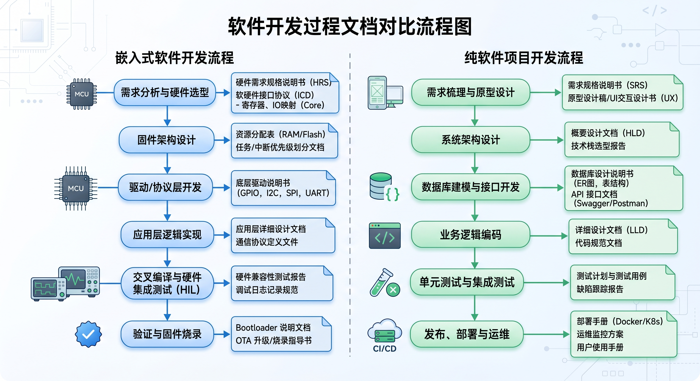
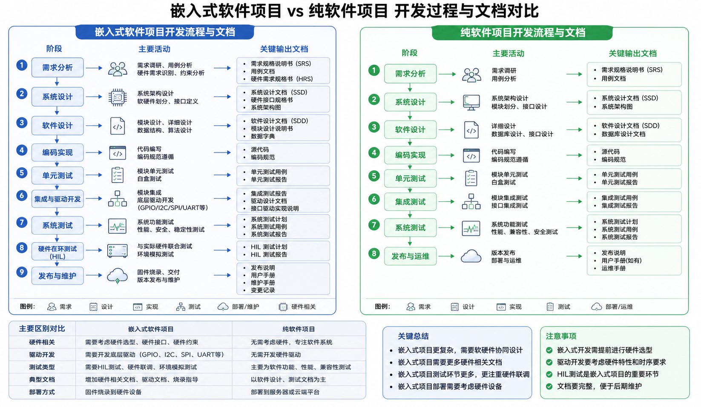
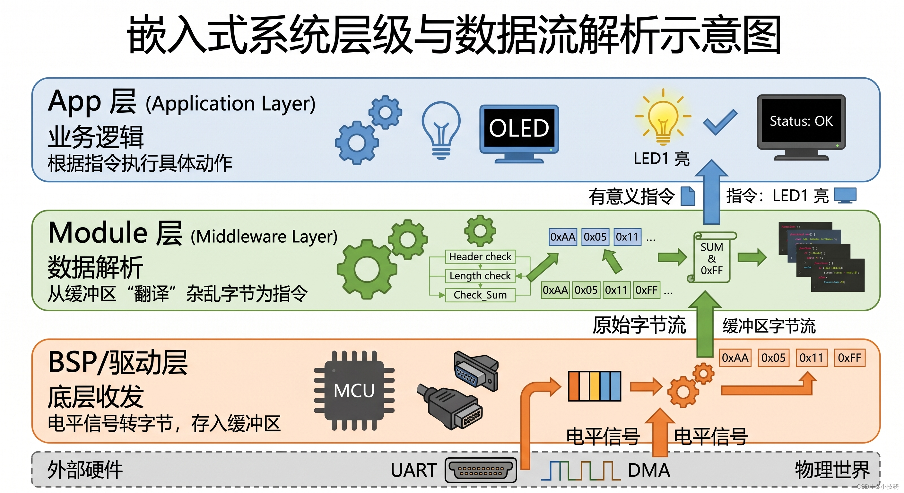
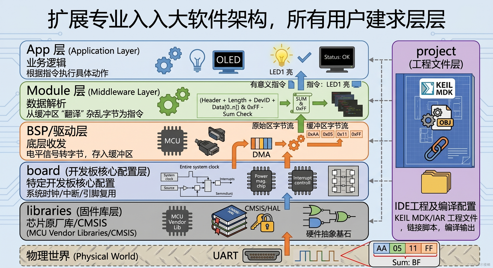

# 3 - 蓝牙和温湿度

> **课程定位：** 5天IoT实训 · 第三天  
> **主题：** AI 辅助开发工具链 · VibeCoding 小程序 · 自定义二进制数据帧 · STM32 串口接收与 LED 控制  
> **项目：** WXMP-IOT — 微信小程序中控系统  
> **目标硬件：** STM32F407ZET6 + BLE DX-BT24 + ESP8266 + DHT11

---

## 一、AI 工具链概览

### 1.1 现代开发者的 AI 工具链


当前主流 AI 辅助开发工具：

| 工具 | 定位 | 适用场景 |
|---|---|---|
| **VibeCoding** | AI 驱动的全栈代码生成（小程序/Web） | 微信小程序、前端页面快速原型 |
| **Cursor** | AI 增强的代码编辑器（IDE） | 日常编码、代码重构、解释代码 |
| **Claude / ChatGPT** | 对话式 AI 助手 | 需求分析、协议设计、文档生成 |
| **GitHub Copilot** | 行内代码补全 | 嵌入已有 IDE，逐行辅助 |

**核心思路：** AI 工具不替代程序员，而是把重复性代码生成交给 AI，让开发者专注在**架构设计**、**调试**和**验证**上。

---

### 1.2 嵌入式开发 vs 纯软件开发





| 维度 | 纯软件项目 | 嵌入式项目 |
|---|---|---|
| **运行环境** | PC / 服务器 / 手机 OS | 裸机 MCU（无 OS 或 RTOS） |
| **调试方式** | printf / IDE 断点 / 浏览器 DevTools | UART 打印 / Keil 仿真器 / 示波器 |
| **AI 生成代码** | 直接运行，秒级验证 | 需编译烧录，分钟级验证 |
| **迭代速度** | 极快（保存即生效） | 较慢（编译 + 烧录 + 复位） |
| **调试难点** | 逻辑错误为主 | 硬件时序、电平、外设配置 |

**结论：** 嵌入式项目用 AI 生成**驱动代码模板**效率最高；涉及硬件时序的代码仍需人工精调。

---

### 1.3 嵌入式系统层级与数据流





WXMP-IOT 项目采用**三端架构**：

```
微信小程序（上位机）
        │ BLE / WiFi
        ▼
STM32F407（下位机）
    ├── BLE DX-BT24  ← UART2
    ├── ESP8266 WiFi  ← UART3
    ├── DHT11 温湿度  ← GPIO
    └── LED x4        ← GPIO
```

数据流方向：小程序发送控制帧 → BLE 透传到 STM32 UART → 解析帧 → 执行动作（开/关 LED）→ 上报结果。

---

## 二、VibeCoding 小程序开发

### 2.1 什么是 VibeCoding

**VibeCoding** 是一种以自然语言描述需求，由 AI 自动生成完整项目代码的开发方式。用于微信小程序时，只需描述页面功能和交互逻辑，AI 即可生成：

- 页面结构（WXML）
- 样式（WXSS）
- 逻辑（JavaScript）
- 蓝牙/网络调用代码（`wx.createBLEConnection` 等）

### 2.2 工程目录结构

用 VibeCoding 生成的微信小程序工程标准结构：

```
wxmp-iot/
├── app.js              ← 全局 App 实例，初始化蓝牙权限
├── app.json            ← 全局配置：页面注册、导航栏样式
├── app.wxss            ← 全局样式
├── pages/
│   ├── index/          ← 首页（设备列表 + 扫描）
│   │   ├── index.wxml
│   │   ├── index.js
│   │   └── index.wxss
│   └── control/        ← 控制页（LED 开关 + 传感器显示）
│       ├── control.wxml
│       ├── control.js
│       └── control.wxss
└── utils/
    ├── ble.js          ← 蓝牙通信封装（连接/发送/接收）
    └── protocol.js     ← 数据帧编解码
```

### 2.3 关键代码片段

#### 小程序发送控制帧（protocol.js）

```javascript
/**
 * 计算 SUM 校验值（所有字节求和保留低8位）
 */
function calcSum(bytes) {
  return bytes.reduce((acc, b) => acc + b, 0) & 0xFF;
}

/**
 * 构建 LED 单独控制帧
 * @param {number} ledNum  LED 编号 1-4
 * @param {number} status  0xFF=亮, 0x00=灭, 0x55=翻转
 * @returns {ArrayBuffer}
 */
function buildLedFrame(ledNum, status) {
  const devId = 0x10 + ledNum;         // 0x11~0x14
  const frame = [0xAA, 0x05, devId, status];
  frame.push(calcSum(frame));           // 追加校验和
  return new Uint8Array(frame).buffer;
}

/**
 * 构建 LED 批量控制帧
 * @param {number[]} leds  4个LED状态 [L1, L2, L3, L4]
 */
function buildLedBatchFrame(leds) {
  const frame = [0xAA, 0x08, 0x10, ...leds];
  frame.push(calcSum(frame));
  return new Uint8Array(frame).buffer;
}

module.exports = { buildLedFrame, buildLedBatchFrame };
```

#### 小程序通过 BLE 发送帧（ble.js）

```javascript
// 已连接到 DX-BT24，serviceId/characteristicId 从扫描时获取
function sendFrame(buffer) {
  wx.writeBLECharacteristicValue({
    deviceId: app.globalData.deviceId,
    serviceId: app.globalData.serviceId,
    characteristicId: app.globalData.writeCharId,
    value: buffer,
    success: () => console.log('帧发送成功'),
    fail: (err) => console.error('发送失败', err)
  });
}

// 点击"LED1 亮"按钮
onLed1On() {
  const buf = protocol.buildLedFrame(1, 0xFF);
  sendFrame(buf);
}
```

---

## 三、自定义数据帧协议

### 3.1 帧结构设计

```
┌─────────┬───────────┬──────────┬──────────────────────┬──────────┐
│  包头   │  数据个数  │  DevID   │       数据内容       │   SUM    │
│  0xAA   │    N      │  DEV(1B) │       DATA(N-2)      │  SUM(1B) │
└─────────┴───────────┴──────────┴──────────────────────┴──────────┘
```

| 字段 | 字节数 | 说明 |
|---|---|---|
| **包头** | 1 | 固定 `0xAA`，帧起始标识 |
| **数据个数 N** | 1 | 帧总长度（含 DevID + 数据内容 + SUM，不含包头和N本身） |
| **DevID** | 1 | 设备/功能编号 |
| **数据内容** | N-2 | 控制参数，字节数 = N - 2 |
| **SUM** | 1 | 前面所有字节（含包头）求和的低8位 |

**SUM 计算公式：**

```
SUM = (0xAA + N + DevID + DATA[0] + DATA[1] + ...) & 0xFF
```

:::tip 为什么 N 不含包头？
包头 `0xAA` 是固定的帧起始标识，解析时直接查找 `0xAA` 即可定位帧头。`N` 从自身开始计数，方便 MCU 按长度读取剩余字节。
:::

---

### 3.2 DevID 速查表

| DevID | 功能 | 数据内容 | 示例帧 |
|---|---|---|---|
| `0x00` | 系统 PING（触发温湿度上报） | 1B: `0x00` | `AA 05 00 00 AF` |
| `0x01` | 系统复位 | 1B: `0x00` | `AA 05 01 00 B0` |
| `0x10` | LED 批量控制 | 4B: `[L1][L2][L3][L4]` | `AA 08 10 FF FF FF FF BF` |
| `0x11` | LED1 控制 | 1B: `FF`=亮 `00`=灭 `55`=翻转 | `AA 05 11 FF BF` |
| `0x12` | LED2 控制 | 同上 | `AA 05 12 FF C0` |
| `0x13` | LED3 控制 | 同上 | `AA 05 13 FF C1` |
| `0x14` | LED4 控制 | 同上 | `AA 05 14 FF C2` |
| `0x21` | DHT11 温湿度上报 | JSON 字符串 | `AA 17 21 7B...7D C6` |
| `0xFF` | 错误响应 | `[原DevID][错误码]` | `AA 06 FF 11 01 C1` |

---

### 3.3 LED 控制帧示例

#### 单独控制 LED

| 操作 | 帧 | SUM 计算 |
|---|---|---|
| LED1 亮 | `AA 05 11 FF BF` | AA+05+11+FF = 0x1BF → 0xBF |
| LED1 灭 | `AA 05 11 00 C0` | AA+05+11+00 = 0xC0 |
| LED1 翻转 | `AA 05 11 55 15` | AA+05+11+55 = 0x115 → 0x15 |
| LED2 亮 | `AA 05 12 FF C0` | AA+05+12+FF = 0x1C0 → 0xC0 |

#### 批量控制 LED

| L1 | L2 | L3 | L4 | 帧 |
|---|---|---|---|---|
| FF | 00 | 00 | 00 | `AA 08 10 FF 00 00 00 C1` |
| 00 | FF | 00 | 00 | `AA 08 10 00 FF 00 00 C1` |
| FF | FF | FF | FF | `AA 08 10 FF FF FF FF BF` |
| 00 | 00 | 00 | 00 | `AA 08 10 00 00 00 00 C2` |
| 55 | 55 | 55 | 55 | `AA 08 10 55 55 55 55 16` |

---

## 四、STM32 串口通信实现

### 4.1 UART 接口分配

| UART | 波特率 | 连接设备 | 用途 |
|---|---|---|---|
| **UART1** | 115200 | PC / 串口助手 | 调试输出 + 帧测试 |
| **UART2** | 9600 | BLE DX-BT24 | 小程序透传帧数据 |
| **UART3** | 115200 | ESP8266 | WiFi AT 指令 / 帧数据 |

### 4.2 UART 初始化（bsp_uart.c）

在 Day 1 的 UART1（printf 重定向）基础上，新增 **UART2 初始化**用于 BLE 通信：

```c
/* bsp/uart/bsp_uart.c */

#include "bsp_uart.h"

/* ===== UART1 115200 调试口 ===== */
void UART1_Init(uint32_t baudrate)
{
    GPIO_InitTypeDef  GPIO_InitStruct;
    USART_InitTypeDef USART_InitStruct;
    NVIC_InitTypeDef  NVIC_InitStruct;

    RCC_AHB1PeriphClockCmd(RCC_AHB1Periph_GPIOA, ENABLE);
    RCC_APB2PeriphClockCmd(RCC_APB2Periph_USART1, ENABLE);

    /* PA9 = TX, PA10 = RX */
    GPIO_InitStruct.GPIO_Pin   = GPIO_Pin_9 | GPIO_Pin_10;
    GPIO_InitStruct.GPIO_Mode  = GPIO_Mode_AF;
    GPIO_InitStruct.GPIO_Speed = GPIO_Speed_50MHz;
    GPIO_InitStruct.GPIO_OType = GPIO_OType_PP;
    GPIO_InitStruct.GPIO_PuPd  = GPIO_PuPd_UP;
    GPIO_Init(GPIOA, &GPIO_InitStruct);

    GPIO_PinAFConfig(GPIOA, GPIO_PinSource9,  GPIO_AF_USART1);
    GPIO_PinAFConfig(GPIOA, GPIO_PinSource10, GPIO_AF_USART1);

    USART_InitStruct.USART_BaudRate            = baudrate;
    USART_InitStruct.USART_WordLength          = USART_WordLength_8b;
    USART_InitStruct.USART_StopBits            = USART_StopBits_1;
    USART_InitStruct.USART_Parity              = USART_Parity_No;
    USART_InitStruct.USART_HardwareFlowControl = USART_HardwareFlowControl_None;
    USART_InitStruct.USART_Mode                = USART_Mode_Rx | USART_Mode_Tx;
    USART_Init(USART1, &USART_InitStruct);

    /* 使能接收中断 */
    USART_ITConfig(USART1, USART_IT_RXNE, ENABLE);
    NVIC_InitStruct.NVIC_IRQChannel                   = USART1_IRQn;
    NVIC_InitStruct.NVIC_IRQChannelPreemptionPriority = 0;
    NVIC_InitStruct.NVIC_IRQChannelSubPriority        = 0;
    NVIC_InitStruct.NVIC_IRQChannelCmd                = ENABLE;
    NVIC_Init(&NVIC_InitStruct);

    USART_Cmd(USART1, ENABLE);
}

/* printf 重定向 */
int fputc(int ch, FILE *f)
{
    while (USART_GetFlagStatus(USART1, USART_FLAG_TXE) == RESET);
    USART_SendData(USART1, (uint8_t)ch);
    return ch;
}
```

---

### 4.3 数据帧解析（状态机）

接收串口数据帧采用**状态机解析**，避免轮询等待整帧到来：

```c
/* bsp/uart/frame_parser.c */

#include "frame_parser.h"

/* 帧缓冲区（最大64字节） */
#define FRAME_BUF_MAX  64

typedef enum {
    STATE_WAIT_HEADER = 0,   /* 等待包头 0xAA */
    STATE_GET_LEN,           /* 读取长度 N */
    STATE_GET_DATA,          /* 读取 N 字节数据 */
} ParseState;

static ParseState s_state  = STATE_WAIT_HEADER;
static uint8_t    s_buf[FRAME_BUF_MAX];
static uint8_t    s_len    = 0;  /* 期望接收的总字节数（含N本身） */
static uint8_t    s_cnt    = 0;  /* 已接收字节数 */

/* 校验和计算 */
static uint8_t calc_sum(const uint8_t *frame, uint8_t len)
{
    uint8_t sum = 0;
    for (uint8_t i = 0; i < len; i++) sum += frame[i];
    return sum;
}

/**
 * 单字节输入状态机，帧完整时回调 on_frame()
 * @param byte 收到的单字节
 */
void frame_parser_feed(uint8_t byte)
{
    switch (s_state) {
        case STATE_WAIT_HEADER:
            if (byte == 0xAA) {
                s_buf[0] = 0xAA;
                s_state  = STATE_GET_LEN;
            }
            break;

        case STATE_GET_LEN:
            s_len      = byte;          /* N = 数据个数（含DevID+Data+SUM） */
            s_buf[1]   = byte;
            s_cnt      = 2;             /* 已存 AA + N */
            s_state    = STATE_GET_DATA;
            break;

        case STATE_GET_DATA:
            s_buf[s_cnt++] = byte;
            /* 收满 2+N 字节（AA + N + N字节数据） */
            if (s_cnt >= (uint8_t)(s_len + 2)) {
                /* 验证校验和：前(s_cnt-1)字节求和 == 最后1字节 */
                uint8_t expect = calc_sum(s_buf, s_cnt - 1);
                if (expect == s_buf[s_cnt - 1]) {
                    /* 帧合法，回调处理 */
                    on_frame(s_buf, s_cnt);
                } else {
                    printf("SUM ERR: expect 0x%02X got 0x%02X\r\n",
                           expect, s_buf[s_cnt - 1]);
                }
                /* 复位状态机 */
                s_state = STATE_WAIT_HEADER;
                s_cnt   = 0;
            }
            break;
    }
}

/* USART1 中断处理 */
void USART1_IRQHandler(void)
{
    if (USART_GetITStatus(USART1, USART_IT_RXNE) != RESET) {
        uint8_t data = (uint8_t)USART_ReceiveData(USART1);
        frame_parser_feed(data);
    }
}
```

---

## 五、串口数据帧控制 LED

### 5.1 帧处理回调函数

```c
/* app/frame_handler.c */

#include "frame_handler.h"
#include "bsp_led.h"     /* LED_On(), LED_Off(), LED_Toggle() */

/* LED 状态值 */
#define LED_ON     0xFF
#define LED_OFF    0x00
#define LED_TOGGLE 0x55

/**
 * 应用层帧处理：根据 DevID 执行动作
 * @param frame 完整帧缓冲区（含包头~SUM）
 * @param len   帧长度
 */
void on_frame(const uint8_t *frame, uint8_t len)
{
    uint8_t dev_id = frame[2];   /* DevID 在第3字节 */

    switch (dev_id) {

        /* ---- LED 单独控制 0x11~0x14 ---- */
        case 0x11: case 0x12: case 0x13: case 0x14:
        {
            uint8_t led_num = dev_id - 0x10;   /* 1~4 */
            uint8_t status  = frame[3];
            apply_led(led_num, status);
            printf("LED%d %s\r\n", led_num,
                   status == LED_ON  ? "ON" :
                   status == LED_OFF ? "OFF" : "TOGGLE");
            break;
        }

        /* ---- LED 批量控制 0x10 ---- */
        case 0x10:
            for (uint8_t i = 0; i < 4; i++) {
                apply_led(i + 1, frame[3 + i]);
            }
            printf("LED batch: L1=%02X L2=%02X L3=%02X L4=%02X\r\n",
                   frame[3], frame[4], frame[5], frame[6]);
            break;

        /* ---- 系统 PING ---- */
        case 0x00:
            printf("PING received\r\n");
            /* TODO: 触发 DHT11 上报 */
            break;

        default:
            printf("Unknown DevID: 0x%02X\r\n", dev_id);
            break;
    }
}

/* LED 动作执行（封装亮/灭/翻转） */
static void apply_led(uint8_t led_num, uint8_t status)
{
    switch (status) {
        case LED_ON:     LED_On(led_num);     break;
        case LED_OFF:    LED_Off(led_num);    break;
        case LED_TOGGLE: LED_Toggle(led_num); break;
    }
}
```

---

### 5.2 LED BSP 驱动（bsp_led.c）

```c
/* bsp/led/bsp_led.c — LED1=PG14, LED2=PG13, LED3=PG6, LED4=PG7 */

#include "bsp_led.h"

static GPIO_TypeDef* LED_PORT[] = {GPIOG, GPIOG, GPIOG, GPIOG};
static uint16_t      LED_PIN[]  = {GPIO_Pin_14, GPIO_Pin_13,
                                   GPIO_Pin_6,  GPIO_Pin_7};

void LED_Init(void)
{
    GPIO_InitTypeDef GPIO_InitStruct;
    RCC_AHB1PeriphClockCmd(RCC_AHB1Periph_GPIOG, ENABLE);

    GPIO_InitStruct.GPIO_Mode  = GPIO_Mode_OUT;
    GPIO_InitStruct.GPIO_OType = GPIO_OType_PP;
    GPIO_InitStruct.GPIO_Speed = GPIO_Speed_2MHz;
    GPIO_InitStruct.GPIO_PuPd  = GPIO_PuPd_NOPULL;

    for (int i = 0; i < 4; i++) {
        GPIO_InitStruct.GPIO_Pin = LED_PIN[i];
        GPIO_Init(LED_PORT[i], &GPIO_InitStruct);
        GPIO_SetBits(LED_PORT[i], LED_PIN[i]);  /* 默认关闭（高电平灭） */
    }
}

void LED_On(uint8_t n)     { GPIO_ResetBits(LED_PORT[n-1], LED_PIN[n-1]); }
void LED_Off(uint8_t n)    { GPIO_SetBits(LED_PORT[n-1],   LED_PIN[n-1]); }
void LED_Toggle(uint8_t n) { LED_PORT[n-1]->ODR ^= LED_PIN[n-1]; }
```

---

### 5.3 main.c 整合

```c
/* app/main.c */

#include "board.h"
#include "bsp_uart.h"
#include "bsp_led.h"

int main(void)
{
    Board_Init();      /* SysTick + 时钟初始化 */
    LED_Init();        /* 初始化 4 个 LED */
    UART1_Init(115200);/* 调试口，接收帧数据 */

    printf("WXMP-IOT Ready. Waiting for frames...\r\n");

    while (1) {
        /* 帧解析在 USART1_IRQHandler 中异步处理，主循环保持空闲 */
        Delay_ms(500);
    }
}
```

---

## 六、调试验证

### 6.1 用串口助手发送测试帧

打开串口助手（如 SSCOM / 友善串口），选择正确 COM 口，波特率 **115200**，发送十六进制帧：

| 测试用例 | 发送帧（HEX） | 预期现象 |
|---|---|---|
| LED1 亮 | `AA 05 11 FF BF` | LED1 亮起 |
| LED1 灭 | `AA 05 11 00 C0` | LED1 熄灭 |
| 全部亮 | `AA 08 10 FF FF FF FF BF` | 4 个 LED 全亮 |
| 全部灭 | `AA 08 10 00 00 00 00 C2` | 4 个 LED 全灭 |
| 全部翻转 | `AA 08 10 55 55 55 55 16` | 4 个 LED 状态取反 |
| 系统 PING | `AA 05 00 00 AF` | 串口打印 "PING received" |

### 6.2 SUM 校验验证

```
以 "LED1亮" 帧为例：
帧内容：AA 05 11 FF
SUM = 0xAA + 0x05 + 0x11 + 0xFF = 0x1BF
     取低8位 → 0xBF
完整帧：AA 05 11 FF BF  ✓
```

:::tip 快速验证 SUM
可以在 [网站课程页](https://viviwong.github.io/web/03-5daysIOT2.html) 的**校验和计算器**中，输入 `AA 05 11 FF` 点击"计算"，即可自动得出 `BF`。
:::

---

## 七、BLE AT 调试（DX-BT24）

DX-BT24 模块支持通过串口发送 AT 指令进行配置：

| 指令 | 功能 | 示例 |
|---|---|---|
| `AT+NAME=xxxx` | 修改蓝牙广播名 | `AT+NAME=IOT-BOARD` |
| `AT+BAUD=4` | 修改波特率（4=9600） | `AT+BAUD=4` |
| `AT+RST` | 重启模块 | `AT+RST` |
| `AT+VERSION` | 查询固件版本 | — |

**调试步骤：**

1. DX-BT24 的 TX/RX 直接连接到 PC 的 USB 串口（**不经过 STM32**）
2. 串口助手发送 AT 指令（末尾需加 `\r\n`）
3. 模块回复 `OK` 表示成功
4. 修改名称后，手机蓝牙列表中设备名即更新

---

## 八、验收标准

完成 Day 2 学习后，能够独立完成以下操作：

- [ ] 使用 VibeCoding 生成一个包含 BLE 连接的微信小程序页面框架
- [ ] 手工计算任意控制帧的 SUM 校验值
- [ ] 用串口助手发送十六进制帧，控制 STM32 上的 LED 亮灭
- [ ] 在 Keil 中阅读并运行帧解析状态机代码，理解状态转移逻辑
- [ ] 修改 DX-BT24 蓝牙广播名称

---

## 常见问题

**Q: 发送帧后 LED 没有反应？**  
A: 检查以下几点：① SUM 是否计算正确；② 串口助手是否选择了"HEX 发送"模式（不要发 ASCII 字符）；③ UART 波特率是否匹配（115200）。

**Q: 串口有输出但 SUM ERR？**  
A: 重新计算 SUM，常见错误是漏算包头 `0xAA` 或包头后的长度字节 `N`。

**Q: VibeCoding 生成的代码能直接用吗？**  
A: 作为代码**框架**可以直接用，但蓝牙 UUID、数据帧格式需要根据实际硬件调整。AI 生成的代码一定要在真实设备上验证。

**Q: DX-BT24 AT 指令没有回应？**  
A: 确认模块处于**命令模式**（未与手机连接时），部分版本需要在发送前先断开已有 BLE 连接。波特率默认为 9600，确认串口助手设置正确。
