# 5 - MQTT 与华为云 IoT 平台


> **课程定位：** 5天IoT实训 · 第五天  
> **主题：** MQTT 协议 · 华为云 IoTDA 平台接入 · STM32 + ESP8266 串口透传  
> **目标：** 完成设备注册 → MQTTX 模拟上报 → 上位机 API 下发指令全链路调通

---
## 使用的调试工具


## 平台-产品-设备

与设备之间的关系图.png)


## 一、整体架构

本课围绕三层通信架构展开：**传感器/执行器 → STM32 → ESP8266（Wi-Fi）→ 华为云 IoT 平台 → 上位机/APP**。

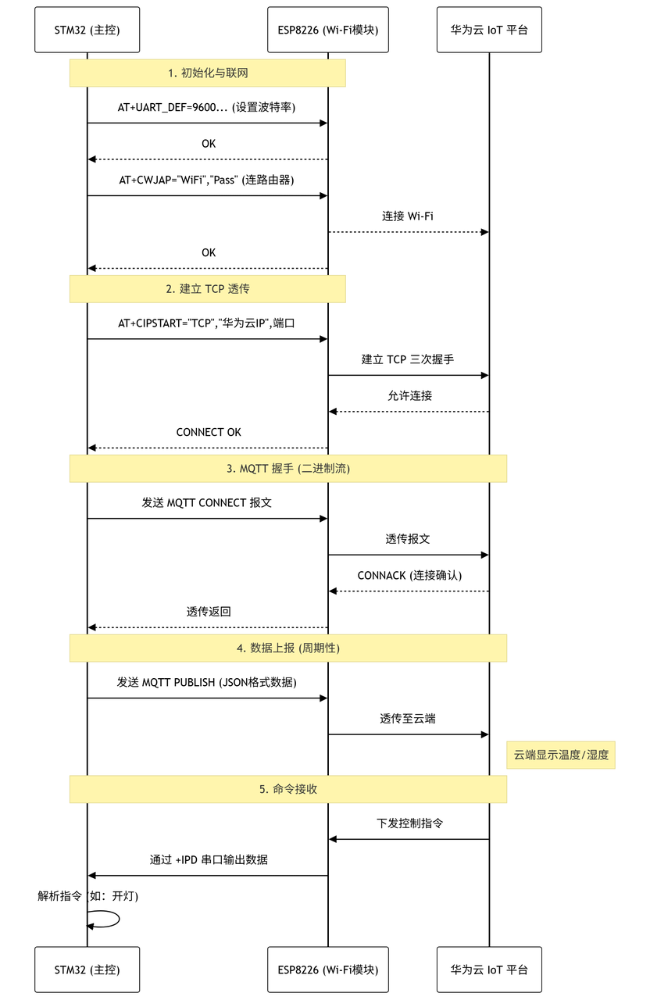

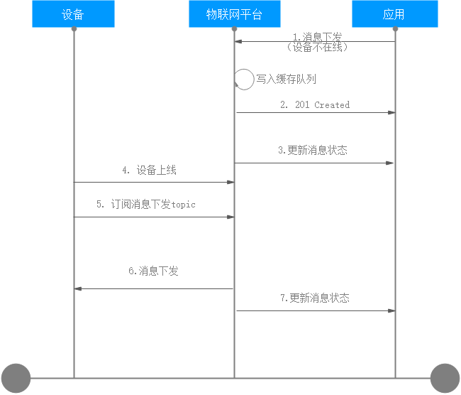

---

## 二、华为云 IoT 平台连接

### 1 创建产品(产品名称\设备类型)

在华为云 IoT 控制台创建产品，需填写：
- **产品名称**：自定义，如 `STM32-Sensor`
- **设备类型**：直连设备
- **协议类型**：MQTT

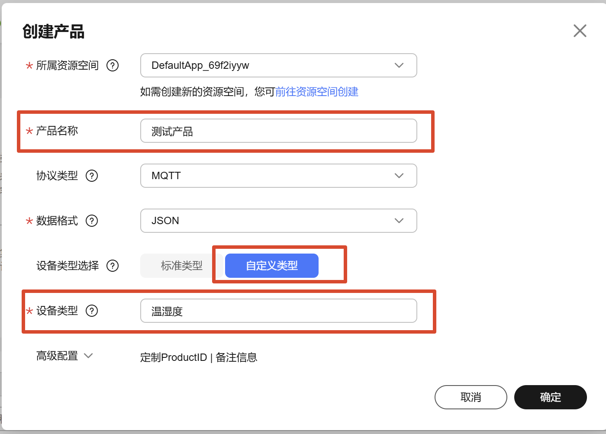

---

### 2 定义模型(服务\属性\设备标识)

自定义模型定义设备的**服务、属性、标识**，平台依此解析上报数据。

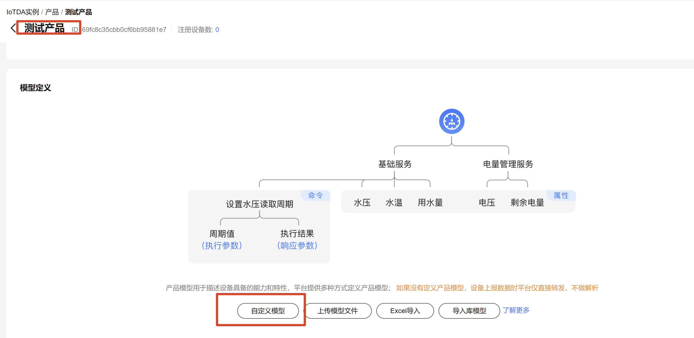

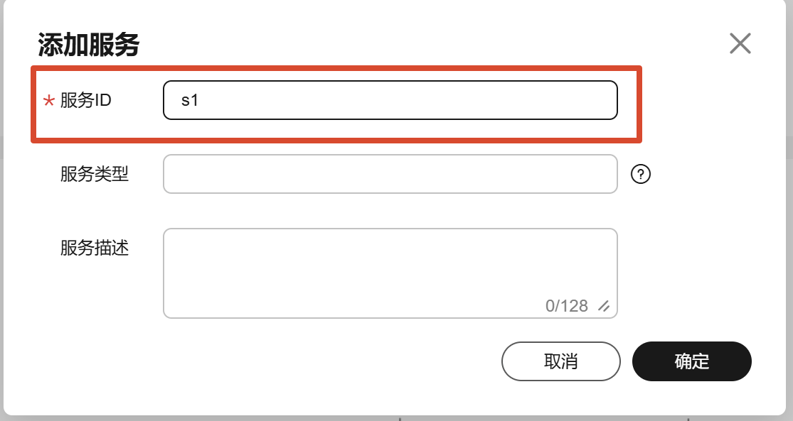

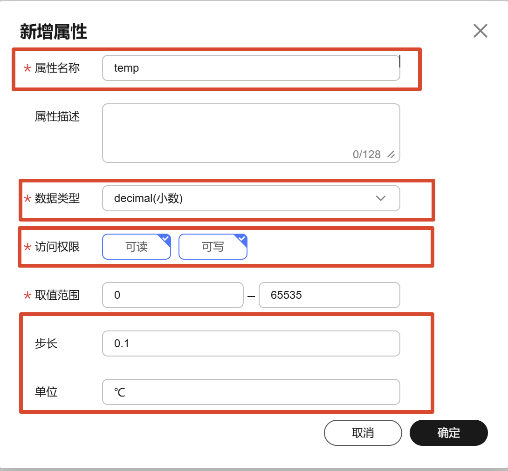

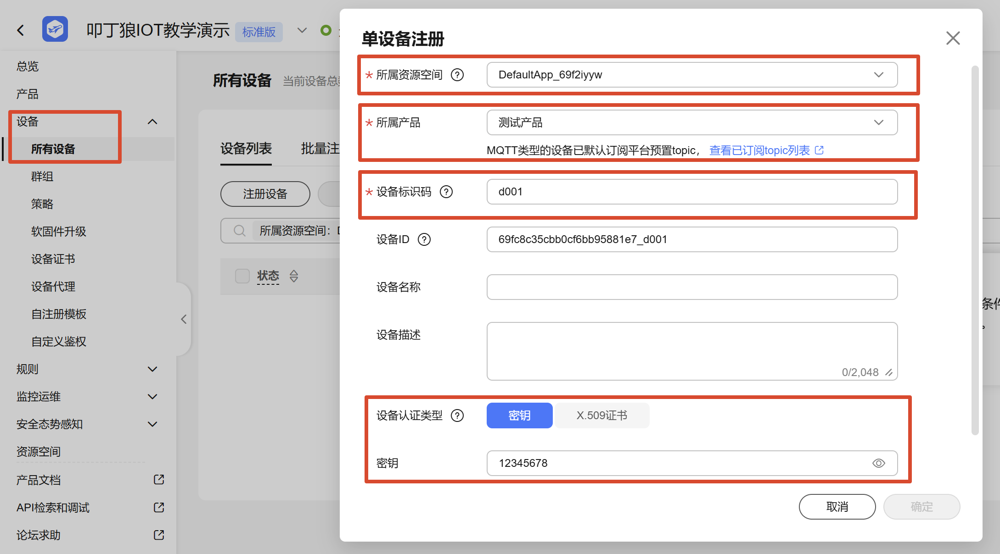

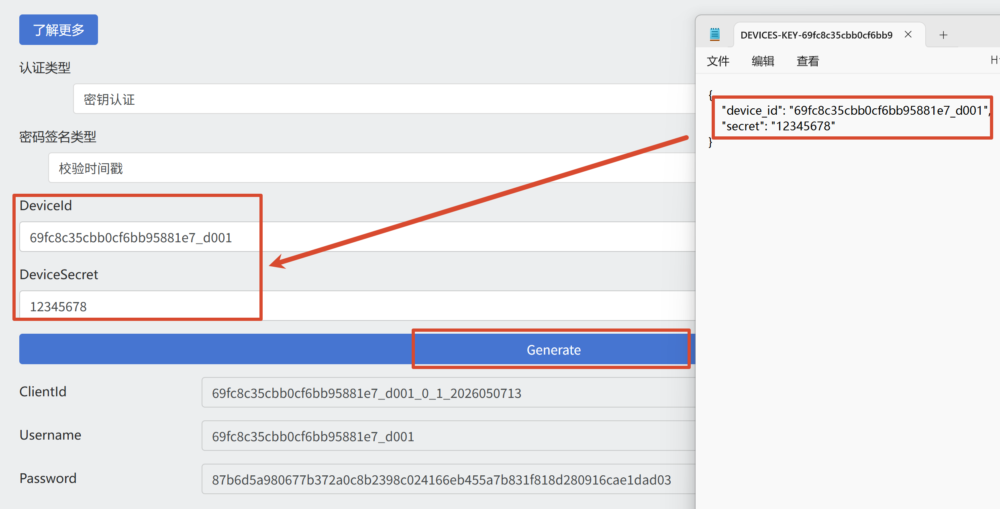

---

### 3 注册设备

在产品下注册具体设备，平台会生成 **设备 ID** 和 **设备密钥**。

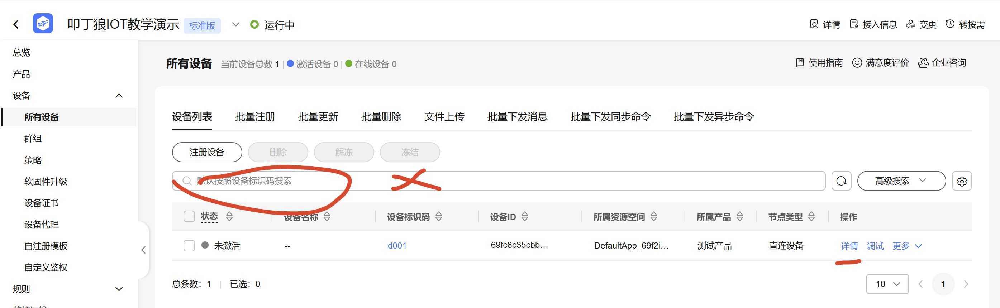

---

### 4 密钥生成

华为云 IoT 的 MQTT 连接需要经过密钥派生，不能直接用注册时的原始密钥。使用官方工具生成 `clientId`、`username`、`password`：

密钥生成工具：[iot-tool.obs-website.cn-north-4.myhuaweicloud.com](https://iot-tool.obs-website.cn-north-4.myhuaweicloud.com/)

> 将设备 ID 和密钥填入工具，即可生成 MQTT 三元组，用于 MQTTX 或 STM32 代码中。

---

### 5 模拟设备连接 MQTTX

在实际硬件调试前，先用 MQTTX 软件模拟设备上云，验证平台配置是否正确。

#### 05.1 上报数据：设备 → 华为
上报数据 MQTTX【模拟设备】==>华为物联网 上报数据-链接
**连接参数配置**：

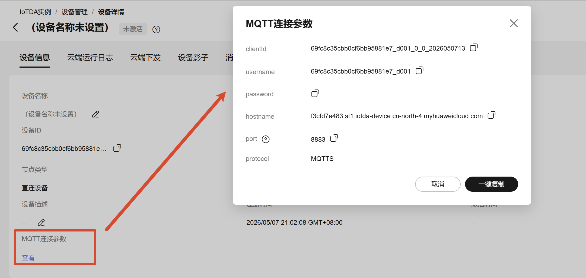

**上报数据操作**：

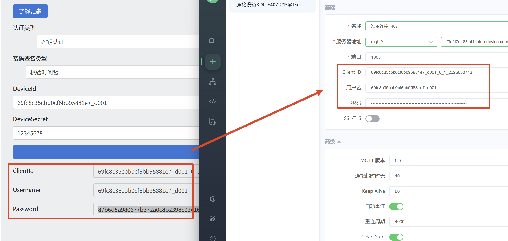

**上报成功结果**：

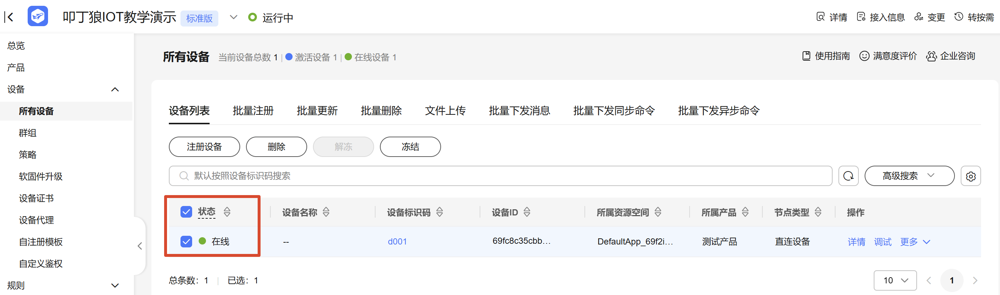

**华为云平台收到数据**：

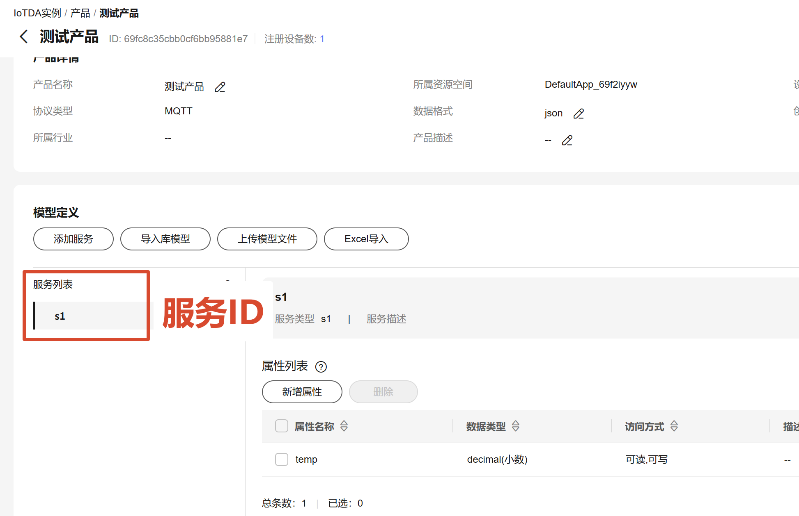

上报数据格式参考文档：[华为云最佳实践](https://support.huaweicloud.com/bestpractice-iothub/iot_bp_00016.html#section7)

上报 JSON 格式示例：

```json
{
  "services": [
    {
      "service_id": "Sensor",
      "properties": {
        "temperature": 25,
        "humidity": 60
      }
    }
  ]
}
```

#### 05.2 下发消息：华为 → 设备
05.2 下发消息 华为物联网 ==> MQTTX【模拟设备】 消息下发
平台与设备的三方关系：

| 角色 | 说明 |
| :--- | :--- |
| **物联网平台** | 消息路由中枢，负责转发指令 |
| **设备** | 订阅命令 Topic，执行动作 |
| **订阅者/应用** | 通过 API 向平台发指令，平台再下发给设备 |

**MQTTX 订阅并接收消息**：

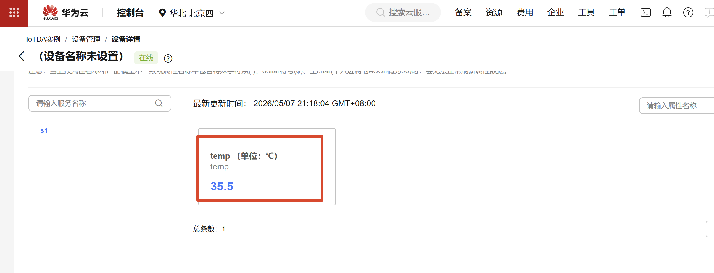

**华为云平台下发配置**：

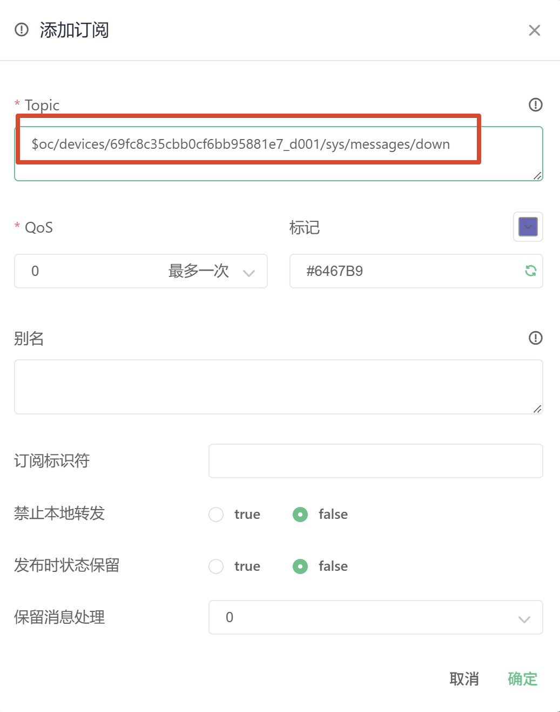

**下发结果**：

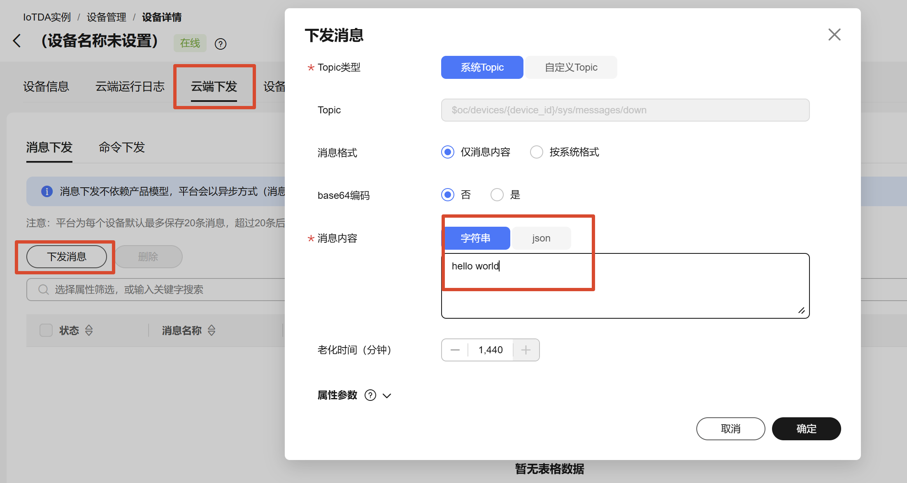

下发消息文档：[消息下发 usermanual](https://support.huaweicloud.com/usermanual-iothub/iot_01_0331.html)

---

### 6 上位机 / APP 调用 API 控制设备

数据链路：**上位机 / APP → 华为物联网平台 API → MQTT 下发 → 设备**

#### 06.1 获取 Token

调用华为云 IoT API 前，需先通过 IAM 获取访问令牌（Token）。

**IAM 管理入口**：
- API 凭证：[IAM 概览](https://console.huaweicloud.com/iam/?region=cn-north-4&locale=zh-cn#/mine/apiCredential)
- 子用户管理：[IAM 用户列表](https://console.huaweicloud.com/iam/?region=cn-north-4&locale=zh-cn#/iam/users)

**在线调试页面**（获取 Token 接口）：
[KeystoneCreateUserTokenByPassword](https://console.huaweicloud.com/apiexplorer/?region=cn-north-4#/openapi/IAM/doc?api=KeystoneCreateUserTokenByPassword)

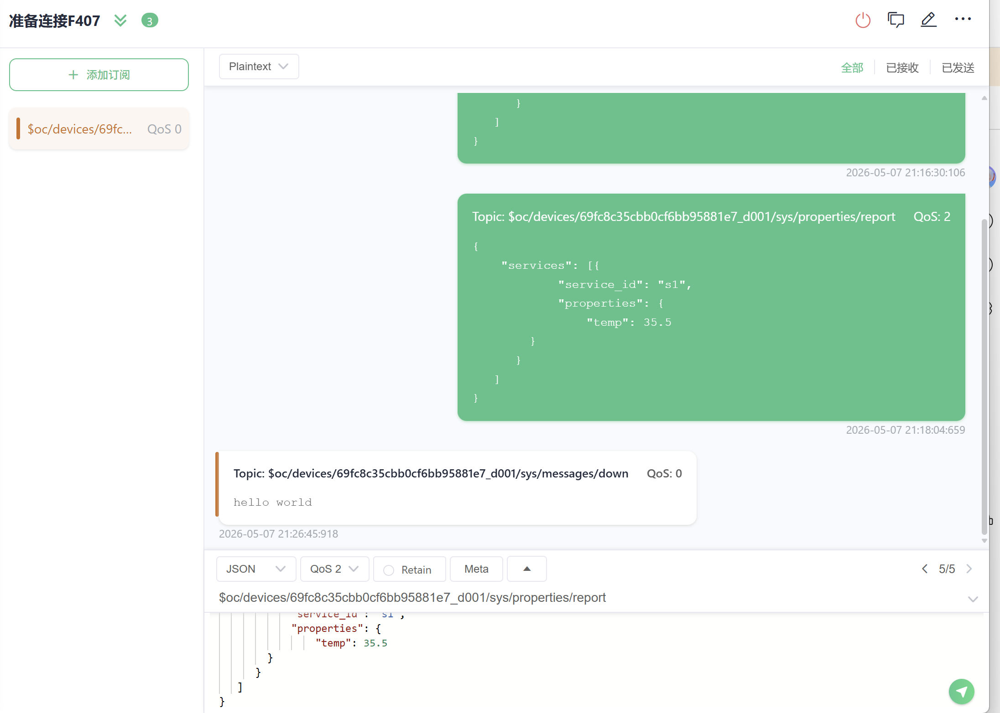

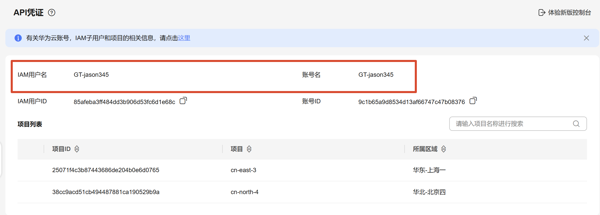

拿到 Token 后即可调用所有 IoTDA API。

**常见错误处理**：

| 错误码 | 含义 | 解决方案 |
| :--- | :--- | :--- |
| `IOTDA.000021` | IAM Token 所在用户未订阅设备接入服务 | 确认子用户已开通 IoTDA 权限 |

- 官方错误码表：[ErrorCode.html](https://support.huaweicloud.com/api-iothub/ErrorCode.html)
- 社区解答：[CSDN 博文](https://blog.csdn.net/zangjishan/article/details/147404300)

---

#### 06.2 设备影子

设备影子存储设备的**最新期望状态和上报状态**，即使设备离线也可查询。

API 文档：[设备影子 v5](https://support.huaweicloud.com/api-iothub/iot_06_v5_0079.html)

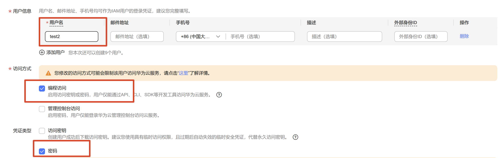

---

#### 06.3 上位机给设备发送
消息 / 指令

通过 API 向平台发送指令，平台再路由到目标设备。

API 文档：[IoT API v5](https://support.huaweicloud.com/api-iothub/iot_06_v5_0001.html)

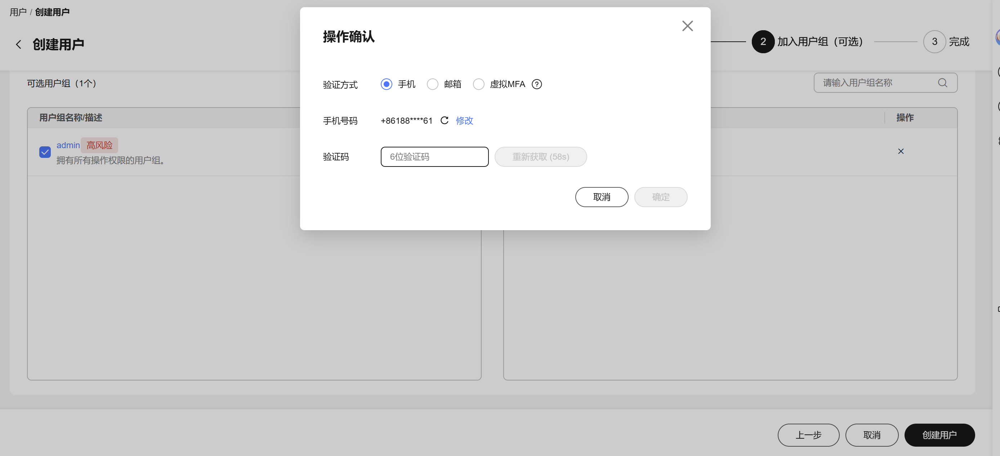

---

#### 06.4 下发设备消息

API 文档：[下发设备消息 v5](https://support.huaweicloud.com/api-iothub/iot_06_v5_0059.html)

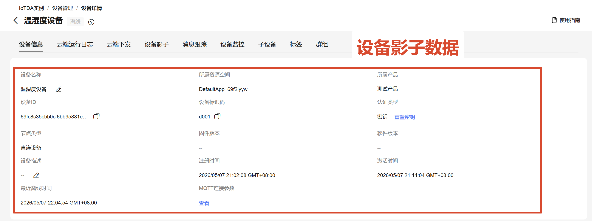

---

## 三、STM32 + ESP8266 串口透传

### 实现 MQTT 通信

在嵌入式端，ESP8266 仅作为**透明传输通道**，复杂的 MQTT 协议逻辑全部由 STM32 实现。

### 硬件连接与协议栈层次

```
[ 传感器 ]
    |
[ STM32 ]  ← 构造 MQTT 报文、处理业务逻辑
    | UART（AT 指令 / 透传数据）
[ ESP8266 ] ← 仅负责 Wi-Fi 接入和 TCP 数据搬运
    | TCP/IP
[ 华为云 IoT 平台 ]
    |
[ 上位机 / 小程序 ]
```

### 整体交互时序图

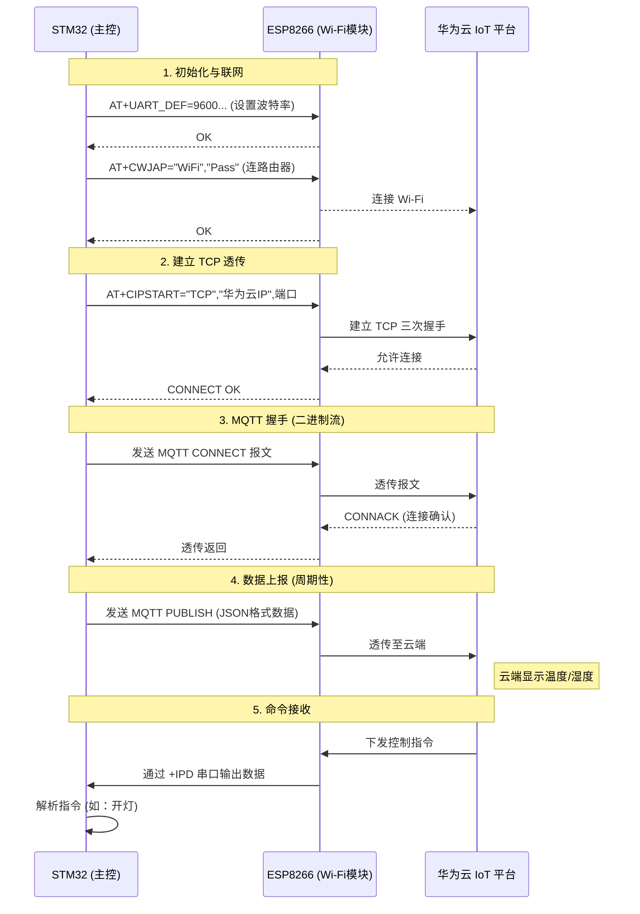
```mermaid
sequenceDiagram
    participant S as STM32 (主控)
    participant E as ESP8266 (Wi-Fi模块)
    participant C as 华为云 IoT 平台

    Note over S,E: 1. 初始化与联网
    S->>E: AT+UART_DEF=9600... (设置波特率)
    E-->>S: OK
    S->>E: AT+CWJAP="WiFi","Pass" (连路由器)
    E-->>C: 连接 Wi-Fi
    E-->>S: OK

    Note over S,E: 2. 建立 TCP 透传
    S->>E: AT+CIPSTART="TCP","华为云IP",端口
    E->>C: 建立 TCP 三次握手
    C-->>E: 允许连接
    E-->>S: CONNECT OK

    Note over S,C: 3. MQTT 握手 (二进制流)
    S->>E: 发送 MQTT CONNECT 报文
    E->>C: 透传报文
    C-->>E: CONNACK (连接确认)
    E-->>S: 透传返回

    Note over S,C: 4. 数据上报 (周期性)
    S->>E: 发送 MQTT PUBLISH (JSON格式数据)
    E->>C: 透传至云端
    Note right of C: 云端显示温度/湿度

    Note over C,S: 5. 命令接收
    C->>E: 下发控制指令
    E->>S: 通过 +IPD 串口输出数据
    S->>S: 解析指令 (如：开灯)
```

### 核心步骤解析

| 阶段 | 关键操作 | 理解重点 |
| :--- | :--- | :--- |
| **基础连接** | AT 指令配置 | 让 ESP8266 能够上网，并找到华为云的 IP 和端口 |
| **身份认证** | MQTT CONNECT | `clientId`、`username`、`password` 由密钥工具生成，是设备的"身份证" |
| **透传模式** | 数据搬运 | STM32 发出的任何字节，ESP8266 原封不动转发给服务器；**MQTT 协议头必须由 STM32 手动构造** |
| **上行 Pub** | JSON 封装 | 传感器数据包装成 `{"temp": 25}` 格式，云端才能识别 |
| **下行 Sub** | `+IPD` 解析 | 云端下发消息时，ESP8266 在串口数据前加 `+IPD,长度:`，STM32 据此判断有云端指令到来 |

### 开发调试技巧

- **透传模式**：开启 `AT+CIPMODE=1`，再发 `AT+CIPSEND` 进入透传。发送 `+++` 退出透传，恢复 AT 指令模式。
- **串口调试**：通信不通时，先用 USB 转 TTL 连接 ESP8266，在串口助手手动逐条发送 AT 指令，确认每一步返回 `OK` 再继续。
- **抓包验证**：可在 Wireshark 上过滤 MQTT 协议，验证 STM32 发出的 MQTT 报文格式是否正确。