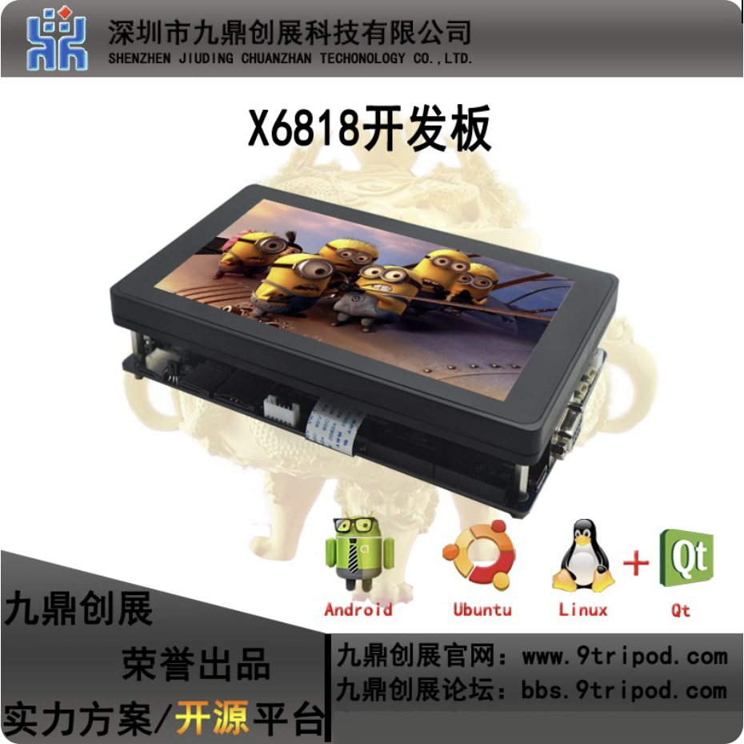
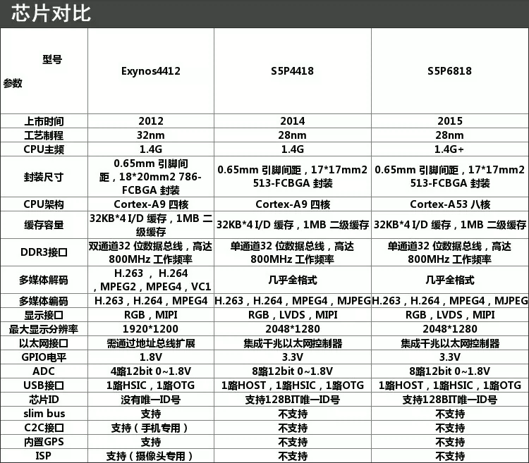

# AI 语音交互智能助手（含大模型）

用心做教育，专注每一位学员的成长

---

## 项目名称

**AI 语音交互智能助手（含大模型接入）**

---

## 1 项目开发背景

随着 ChatGPT、DeepSeek、通义千问等大语言模型（LLM）的爆发，"能听、能说、能思考"的 AI 助手已成为最热门的 AI 应用方向之一。智能音箱、车载语音助手、智能客服、工业巡检助手等场景大量涌现，对掌握**语音识别（STT）+ 大模型 API + 语音合成（TTS）**全链路技术的工程师需求旺盛。

本项目以 S5P6818 开发板为语音前端采集终端，结合 Whisper 离线语音识别、主流大模型 API（DeepSeek / 通义千问）和 TTS 语音合成，构建完整的端到端语音交互助手，使学员直接对标 **AI 应用开发工程师** 岗位。

---

## 2 项目开发目的

- 掌握音频采集与处理（PyAudio、采样率、降噪）
- 学会在嵌入式/PC 端部署 Whisper 模型，实现离线语音转文字
- 掌握大模型 API 调用（DeepSeek / 通义千问 / 讯飞 Spark）及 prompt 工程
- 学会 TTS 语音合成（pyttsx3 / edge-tts），实现文字转语音播放
- 使用 PySide6 构建对话界面，显示对话内容与音频波形动画
- 理解 AI 全链路系统的延迟优化与异步并发设计

**技术栈覆盖：**

| 技术方向 | 具体技术 |
| :--- | :--- |
| 语音识别 | Whisper tiny/base（ONNX 或 PyTorch）|
| 大模型 API | DeepSeek API / 通义千问 API（可切换）|
| 语音合成 | edge-tts / pyttsx3 |
| 音频处理 | PyAudio、numpy、webrtcvad（端点检测）|
| 桌面 UI | PySide6 + 波形动画 |
| 开发平台 | S5P6818（Ubuntu）+ PC |

---

## 3 项目简介

本系统构建完整语音交互流水线：S5P6818 开发板麦克风实时采集音频 → **VAD 端点检测**自动截取有效语句 → Whisper 模型（board 端或 PC 端）完成**离线语音识别（STT）** → 识别文本通过 HTTP 发至 PC 端 → PC 调用 **DeepSeek / 通义千问 API** 获取回答 → **edge-tts** 合成语音经扬声器播放 → 同时 PySide6 界面展示完整对话记录与实时波形动画。

系统支持连续多轮对话，可配置"专属助手角色"（如技术答疑、讲解员、客服）。

---

## 4 项目开发环境

**硬件清单：**

| 设备 | 型号 / 规格 | 数量 |
| :--- | :--- | :--- |
| 嵌入式开发板 | S5P6818（八核 Cortex-A53，1GB RAM）| 1 |
| 麦克风 | USB 麦克风 / 板载麦克风 | 1 |
| 扬声器 | 3.5mm 有源扬声器 / USB 音频 | 1 |
| PC | Windows / Linux（Python 3.10）| 1 |

> 开发板购买：[淘宝链接](https://item.taobao.com/item.htm?id=523974556845)

**软件环境：**

| 端 | 软件 / 库 | 说明 |
| :--- | :--- | :--- |
| 开发板（Ubuntu）| Python 3.10、PyAudio、webrtcvad、openai-whisper | 语音采集 + STT |
| PC | Python 3.10、PySide6、openai（SDK）、edge-tts | 大模型 + TTS + UI |
| 开发工具 | VS Code + SSH Remote、Cursor AI | 开发调试 |
| API 密钥 | DeepSeek API Key 或 通义千问 API Key | 自备（有免费额度）|

---

## 5 项目实施计划

| 阶段 | 时间 | 内容 |
| :--- | :--- | :--- |
| **模块一：音频采集** | 第 1 天 | PyAudio 麦克风采集、WAV 录音存储、webrtcvad 端点检测（自动截句）|
| **模块二：语音识别** | 第 2 天 | Whisper 模型部署与测试、STT 准确率调优、HTTP 接口封装 |
| **模块三：大模型对接** | 第 3 天 | DeepSeek / 通义千问 API 调用、多轮对话上下文管理、Prompt 设计 |
| **模块四：TTS + 播放** | 第 4 天 | edge-tts 语音合成、异步播放、PySide6 对话界面 + 波形动画 |
| **模块五：系统联调** | 第 5 天 | 全链路端到端联调、延迟优化（异步并发）、项目演示答辩 |

---

## 6 项目实训成果

完成本实训后，学员能够独立完成：

- 部署 Whisper 模型并调用 API 实现语音识别
- 调用主流大模型 API，实现多轮对话管理
- 实现 TTS 语音合成并与 UI 同步展示
- 构建具备语音交互能力的 PySide6 桌面应用

**系统架构图：**

```
┌──────────────────────────────────────────────┐
│            S5P6818 开发板（语音前端）          │
│  麦克风 → PyAudio 采集 → webrtcvad 端点检测   │
│  ↓ 有效语音片段（WAV）                        │
│  Whisper STT → 识别文本                       │
│  ↓                                            │
│  HTTP POST → PC 端 /chat 接口                 │
└─────────────────┬────────────────────────────┘
                  │ 局域网 HTTP
┌─────────────────▼────────────────────────────┐
│                   PC 端                       │
│  Flask 接收文本                               │
│  → 大模型 API（DeepSeek / 通义千问）          │
│  → edge-tts 语音合成 → 扬声器播放             │
│  → PySide6 界面（对话记录 + 波形动画）        │
└──────────────────────────────────────────────┘
```

---

## 7 项目运行效果

**开发板（S5P6818）：**





**PySide6 界面参考：**

- 顶部：麦克风实时音频波形动画（录音中/待机状态切换）
- 中部：对话气泡区（用户语音转文字 + AI 回复文本）
- 底部：状态栏（正在识别 / 正在思考 / 正在播报）

---

## 8 项目实施标准

| 考核项 | 评分标准 | 分值 |
| :--- | :--- | :--- |
| 音频采集 | 麦克风正常录音，VAD 能正确截取语句 | 15 分 |
| 语音识别 | Whisper 识别准确率 ≥ 85%（普通话）| 20 分 |
| 大模型对接 | API 调用成功，多轮对话上下文正常 | 25 分 |
| TTS 播放 | 合成语音自然，与界面文字同步 | 15 分 |
| PySide6 界面 | 对话记录完整，波形动画流畅 | 15 分 |
| 项目演示 | 流畅完成一次完整语音对话演示 | 10 分 |
| **合计** | | **100 分** |